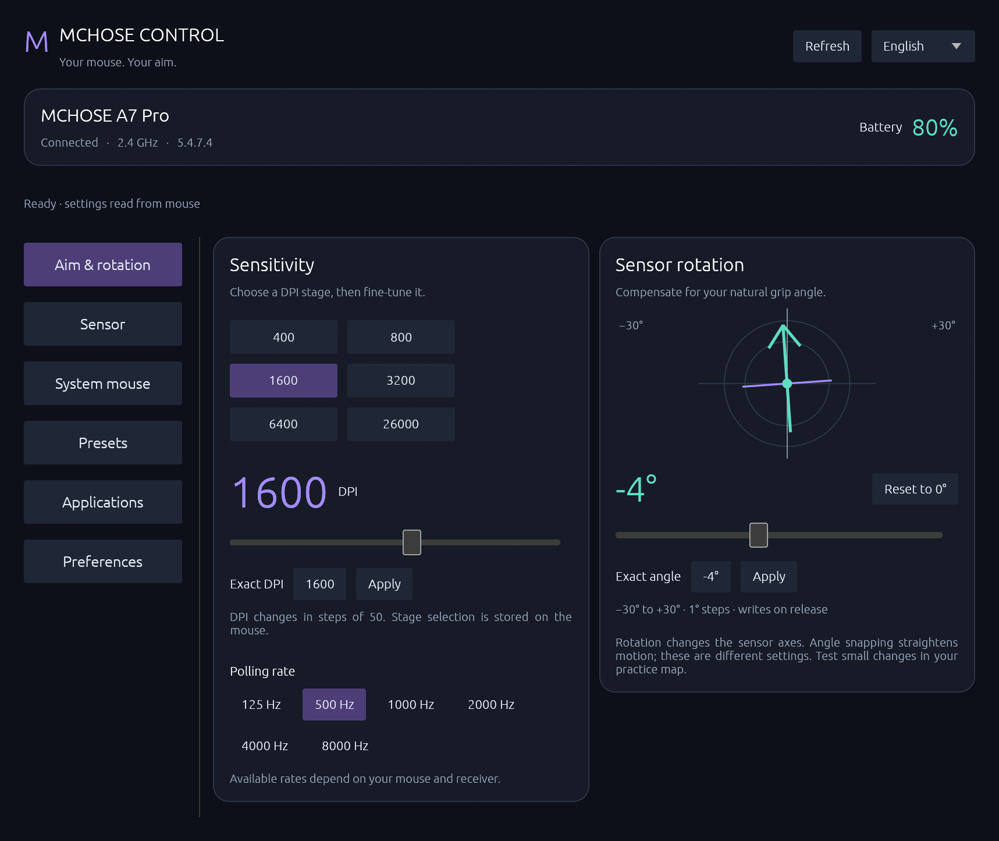
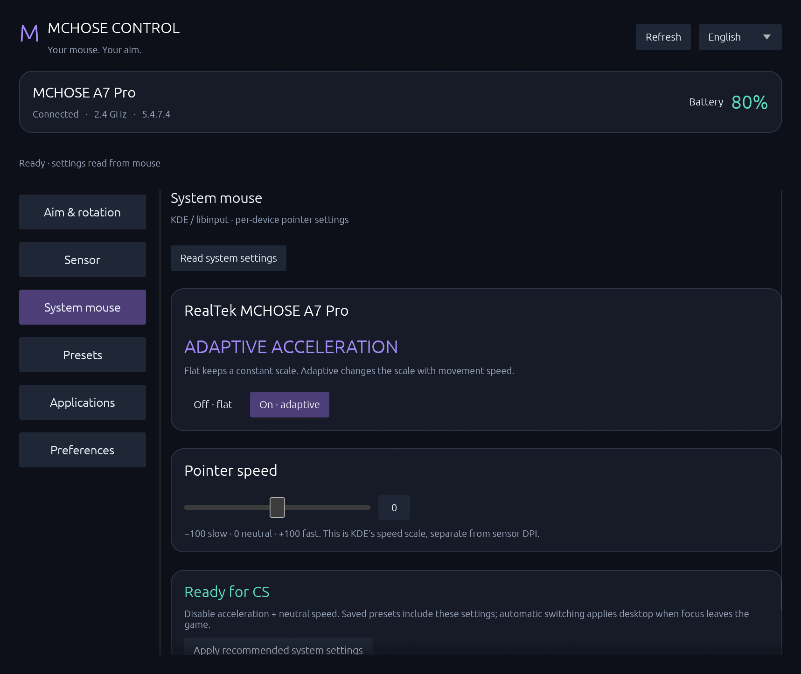
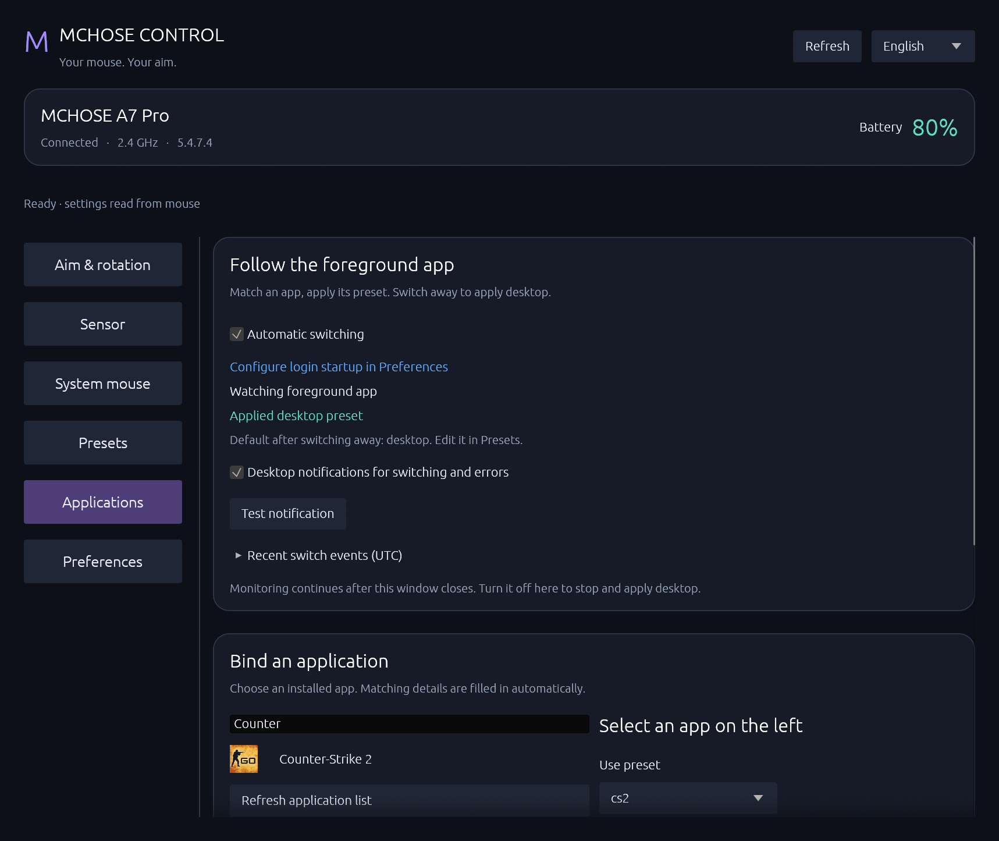
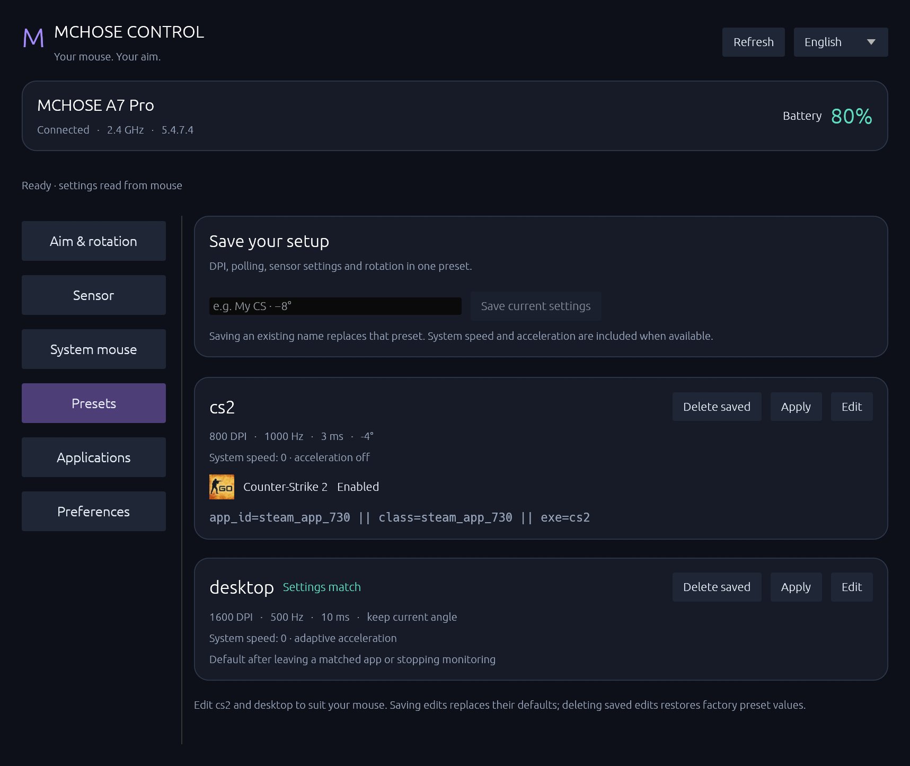

# MCHOSE Control Linux

[简体中文](README.md) | **English**

Configure MCHOSE mice on Linux: DPI, grip-angle compensation, sensor settings, system pointer settings and foreground-application presets that apply your editable `desktop` default when you switch away.

An independent derivative of [Alexandre Frih's mchose-linux](https://github.com/alexfrih/mchose-linux), retaining its HID implementation and extending the GUI, CLI and desktop integration. Unofficial; not affiliated with or endorsed by MCHOSE.

## Real application screenshots

Captured from **0.3.3** on **KDE Plasma 6 / Wayland with a MCHOSE A7 Pro**, firmware **5.4.7.4**. These show actual read-back settings, not mockups or demo data. The displayed values are not recommendations.



| System mouse | Application presets |
| --- | --- |
|  |  |

## Features

- Six DPI stages, exact values, polling rate, and −30°…+30° sensor rotation with a visual guide.
- Motion sync, ripple control, angle snapping, lift-off distance, debounce, sleep and performance mode.
- Per-device KDE pointer speed and flat/adaptive acceleration, separate from hardware DPI.
- Editable named presets including optional rotation and system settings, with Unicode names.
- Installed application and Steam game picker; advanced identifier filters remain available. Uses the foreground application, applying the editable `desktop` default when focus leaves matching applications.
- Readback-confirmed switch notifications, failure details and recent events; parameter matches and active application rules have distinct labels.
- Native tray, close-to-tray, single-instance reopening and login startup. Startup options live in Preferences.
- Chinese by default, with English and system-language options. CLI commands and JSON keys do not change with the display language.

## Presets and automatic switching



- `cs2` is the gaming preset; `desktop` is the desktop default. Starting monitoring outside a matched application immediately applies `desktop`. Leaving a game or stopping monitoring while in a game also applies it.
- Edit either built-in or a custom preset in **Presets → Edit**, including DPI, polling, rotation, sensor and system settings. Saving overrides the built-in; deleting saved edits restores its defaults. Existing custom presets take precedence. Legacy `cs` / `desk` names and bindings remain compatible.
- **Settings match** means the current mouse parameters match that preset. **Applied by app rule** means foreground automation is using it. Manually applying a preset does not imply the game is running.
- Pick an installed application or Steam game. Rebinding the same application updates its rule; the first enabled matching rule wins. Icons come from the local system, with placeholders when unavailable.
- Successful switches, return to desktop and failures produce notifications and recent events. KDE fullscreen / Do Not Disturb policies may suppress popups; events remain available in the application page.

```sh
mchose auto status
mchose auto events
mchose auto notify-test
```

## Game performance and Meta protection (optional)

On CachyOS, use the built-in `game-performance` alongside `ananicy-cpp`. Set the CS2 Steam launch option to:

```text
game-performance %command%
```

This enables the performance power profile for the game's process lifetime and restores the previous profile on exit; switching focus does not turn it off. Other distributions can consider [Feral GameMode](https://github.com/FeralInteractive/gamemode). Avoid stacking competing scheduler settings; see the [CachyOS gaming guide](https://wiki.cachyos.org/configuration/gaming/). Steam CS2 does not require Lutris.

An independent, optional **CS2 Meta guard** temporarily suspends KDE desktop keyboard shortcuts containing Meta while CS2 is focused. Alt+Tab and non-Meta bindings remain available; switching away restores the original shortcuts. It works independently of mouse monitoring and does not disable all global shortcuts. Requires KDE Plasma 6, Python 3 / Gio and user systemd; it is not installed by default. [Installation, removal and recovery](docs/gaming.en.md).

## Install

Requires Rust/Cargo, a Linux graphical environment and its development libraries. KDE system settings, foreground monitoring and tray integration require **Python 3 + PyGObject (Gio)**. Install **Noto Sans CJK** for Chinese text. Install these through your distribution's package manager.

```sh
git clone https://github.com/zzxzzk115/mchose-control-linux.git
cd mchose-control-linux
./install.sh
mchose-gui --lang en
```

The installer builds the GUI and CLI, installs the launcher/icon and `~/.local/bin` links, and uses `sudo` to install the udev rule. Normal operation does not require root. If needed, launch `~/.local/bin/mchose-gui` directly. The command names `mchose` / `mchose-gui` and `~/.config/mchose` paths remain compatible with previous configurations.

CLI only: `cargo build --release`. Refresh an existing desktop installation: `./install.sh --desktop-only`.

## Usage

```sh
mchose --lang en info
mchose show --json
mchose rotation -4
mchose dpi 800
mchose system acceleration off
mchose preset save my-cs
mchose auto apps Counter
mchose auto bind-app steam_app_730 my-cs
mchose auto start
mchose auto stop
```

The GUI application picker avoids typing identifiers. Closing to the tray keeps monitoring active. **Quit and restore** stops automatic switching and applies the `desktop` preset. Login startup is configured separately for the GUI and automatic preset service in Preferences.

The built-in `cs2` preset uses 800 DPI, 1000 Hz, flat system acceleration and neutral system speed, preserving your current grip angle. Edit and save it directly without first applying it to the mouse. The −100…+100 speed scale maps to libinput −1…+1; it is neither a Windows speed level nor a percentage gain. Raw-input games may bypass desktop pointer settings; in-game sensitivity is separate.

Choose a language in the GUI or use `mchose --lang en --help`. With no saved preference, Chinese is the default; existing language preferences are preserved.

## Compatibility and limitations

This branch is tested on the **A7 Pro (5253:1021)**. Upstream tested the L7 Pro. Devices are detected using the vendor ID and HID collection, but other models still need individual validation.

System pointer settings and foreground monitoring currently target **KDE Plasma 6**; our live tests use Wayland. System writes require exactly one supported MCHOSE pointer. Native tray integration uses StatusNotifierItem/DBusMenu, with KWin managing this application's Wayland window. An unavailable tray does not cause the window to be hidden.

LOD cannot be read from hardware and displays the last tool-written value. Sensor rotation is distinct from angle snapping. Normal automatic-controller shutdown applies `desktop`; forced termination, power loss or device removal cannot guarantee restoration. No firmware writes are performed. Hardware and desktop tests do not verify the input pipeline inside CS itself.

Further documentation: [Chinese guide](README.zh-CN.md), [protocol](PROTOCOL.md), [protocol analysis tools](protocol/README.md).

## Development

0.3.3 fixes missing desktop defaults at monitoring startup. 0.3.2 fixes false failures caused by an A7 Pro firmware-owned status bit and missed GUI refreshes while busy. Validation includes 23 Rust tests and A7 Pro / KDE Wayland checks for preset writes, startup defaults, switch-away behavior, notifications and Meta protection. Focus tests use a temporary test window; these are not CS2 gameplay benchmarks.

```sh
cargo fmt --check
cargo test --features gui
cargo build --release --features gui
mchose-gui --demo --lang en
```

When reporting an issue, include the model, firmware, desktop environment and reproduction steps. Review logs for personal window titles and paths before posting.

## Acknowledgements and license

- [alexfrih/mchose-linux](https://github.com/alexfrih/mchose-linux), by Alexandre Frih: the original protocol research, HID communication, CLI and GUI on which this work is based. The upstream MIT copyright notice and attribution are retained.
- [egui / eframe](https://github.com/emilk/egui) and [libc](https://github.com/rust-lang/libc): Rust UI and system interfaces.
- [KDE / KWin](https://invent.kde.org/plasma/kwin), [libinput](https://gitlab.freedesktop.org/libinput/libinput), [PyGObject](https://gitlab.gnome.org/GNOME/pygobject) and [GLib / Gio](https://gitlab.gnome.org/GNOME/glib): desktop input, window management and D-Bus integration.
- [Babel](https://github.com/babel/babel): JavaScript components used by the inherited protocol analysis tools.

[MIT License](LICENSE). Third-party components retain their own licenses; see [ACKNOWLEDGEMENTS](ACKNOWLEDGEMENTS.md) and the [Rust dependency inventory](THIRD_PARTY.md). MCHOSE, M HUB and product names belong to their respective owners. The vendor JavaScript bundle is not redistributed.
