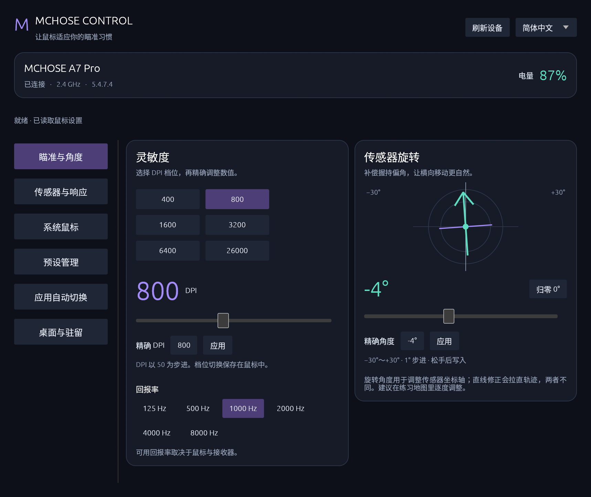
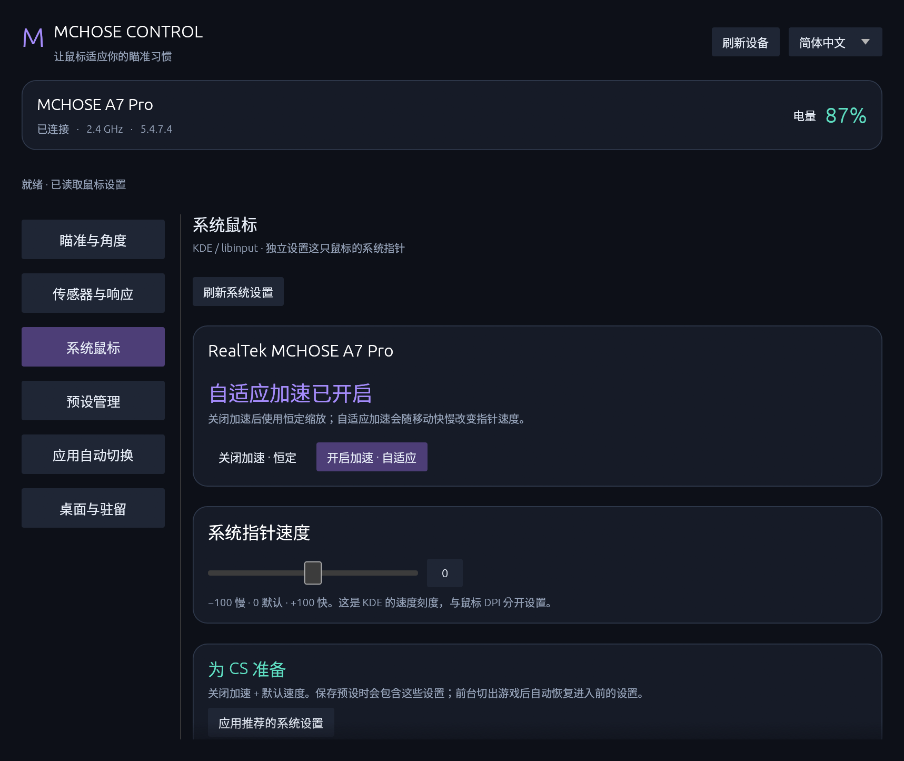
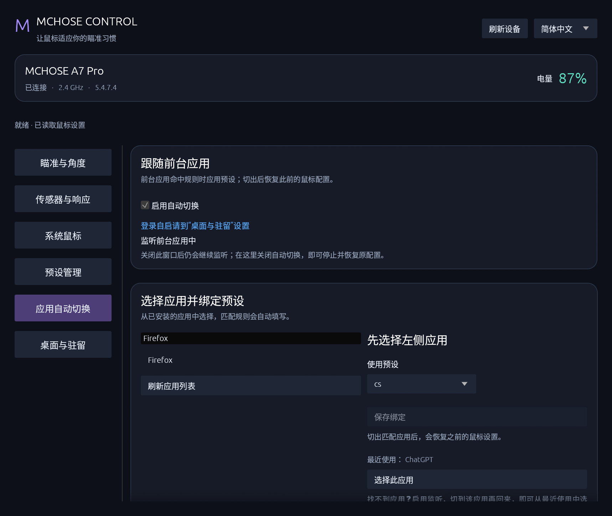

# MCHOSE Control Linux · 迈从鼠标控制中心

**简体中文** | [English](README.en.md)

在 Linux 上调整迈从鼠标的 DPI、握持角度、传感器参数和系统鼠标设置，用前台应用绑定预设，切出游戏后恢复原设置。

基于 [Alexandre Frih 的 mchose-linux](https://github.com/alexfrih/mchose-linux) 开发的独立衍生项目，沿用其 HID 协议实现并扩展 GUI、CLI 与桌面集成。非迈从官方软件，与 MCHOSE 无隶属或背书关系。

## 真实运行截图

以下截图来自 **KDE Plasma 6 / Wayland + MCHOSE A7 Pro** 的实际运行，固件 **5.4.7.4**，不是设计稿或演示数据。显示的参数是截图时的配置，不是推荐值。



| 系统鼠标 | 应用自动切换 |
| --- | --- |
|  |  |

## 功能

- **瞄准与角度**：六档 DPI、精确输入、回报率、−30°～+30° 传感器旋转及角度示意。
- **传感器**：运动同步、波纹控制、直线修正、LOD、消抖、休眠和性能模式。
- **系统鼠标**：KDE 中这只鼠标的系统速度与 flat / adaptive 加速度；与硬件 DPI 分开管理。
- **预设**：保存、应用、删除，支持中文名称；可包含角度和系统鼠标设置。
- **应用绑定**：选择已有应用或已安装的 Steam 游戏；高级用户可展开标识符过滤规则。以前台应用为准，切出后恢复进入前的设置。
- **桌面集成**：原生托盘、关闭驻留、单实例唤回、登录自启。自启选项统一位于“桌面与驻留”。
- **GUI + CLI**：默认中文，可切换英文或跟随系统；JSON 输出和命令名保持稳定。

## 安装

需要 Rust/Cargo、Linux 图形环境，以及图形构建所需的系统库。KDE 系统设置、前台监听和托盘需要 **Python 3 + PyGObject（Gio）**；中文建议安装 **Noto Sans CJK**。使用发行版包管理器安装这些依赖。

```sh
git clone https://github.com/zzxzzk115/mchose-control-linux.git
cd mchose-control-linux
./install.sh
mchose-gui
```

安装脚本构建 GUI 和 CLI，安装应用菜单图标及 `~/.local/bin` 启动入口，并通过 `sudo` 安装 udev 规则。日常使用无需 root。若命令不在 PATH 中，可用 `~/.local/bin/mchose-gui`。保留命令名 `mchose` / `mchose-gui` 和 `~/.config/mchose`，兼容原有配置。

只构建 CLI：`cargo build --release`。更新已有安装的桌面入口：`./install.sh --desktop-only`。

## 快速上手

```sh
mchose info
mchose show --json
mchose rotation -4
mchose dpi 800
mchose system acceleration off
mchose preset save 我的CS
mchose auto apps Counter
mchose auto bind-app steam_app_730 我的CS
mchose auto start
mchose auto stop
```

普通用户可在“应用自动切换”选择应用和预设，无需手写标识符。`auto stop` 会停止监听并恢复进入自动预设前的配置。**关闭到托盘**继续运行；**退出并恢复**会停止自动切换并恢复配置。

内置 `cs` 预设含 800 DPI、1000 Hz、关闭系统加速和系统速度 0，保留当前握持角度；可按自己的习惯另存预设。系统速度刻度 −100～100 对应 libinput −1～1，不是 Windows 档位，也不是百分比增益。使用原始输入的游戏可能绕过系统指针设置，游戏内灵敏度单独调整。

右上角切换语言；CLI 可临时覆盖：`mchose --lang en --help`。未设置偏好时默认中文，已有语言选择保持不变。

## 兼容性与限制

| 部分 | 支持范围 |
| --- | --- |
| HID 配置 | 延续上游协议，按厂商 ID 与 HID collection 发现设备。此分支实测 A7 Pro（5253:1021）；上游验证 L7 Pro。其他型号需分别验证。 |
| 系统鼠标、前台监听 | 当前面向 KDE Plasma 6；本项目实际验证环境为 Wayland。仅在找到唯一受支持的迈从指针设备时允许系统参数写入。 |
| 托盘与驻留 | KDE 原生 StatusNotifierItem / DBusMenu；Wayland 下通过 KWin 管理本程序窗口。托盘不可用时不会主动隐藏窗口。 |

LOD 不能从设备读回，显示的是工具上次写入值。握持角度旋转与直线修正是两种独立功能。自动切换正常退出时恢复配置；强制杀进程、断电或设备断开无法保证恢复。程序不写固件。请勿将本机测试视为所有型号或 CS 游戏内输入链路的验证。

详细说明：[中文使用指南](README.zh-CN.md) · [协议文档](PROTOCOL.md) · [协议分析工具](protocol/README.md)

## 开发

```sh
cargo fmt --check
cargo test --features gui
cargo build --release --features gui
mchose-gui --demo --lang zh  # 无硬件写入的预览
```

提交前请说明鼠标型号、固件、桌面环境和验证方式。Issue 中的日志请先检查并删除个人窗口标题或路径。

## 致谢与许可证

- [alexfrih/mchose-linux](https://github.com/alexfrih/mchose-linux)：Alexandre Frih 提供的 HID 协议逆向、设备通信、CLI 和最初 GUI，是本项目的基础。保留上游 MIT 版权声明，并在此致谢原作者。
- [egui / eframe](https://github.com/emilk/egui) 与 [libc](https://github.com/rust-lang/libc)：Rust 图形界面与系统接口。
- [KDE / KWin](https://invent.kde.org/plasma/kwin)、[libinput](https://gitlab.freedesktop.org/libinput/libinput)、[PyGObject](https://gitlab.gnome.org/GNOME/pygobject)、[GLib / Gio](https://gitlab.gnome.org/GNOME/glib)：桌面输入、窗口与 D-Bus 集成。
- [Babel](https://github.com/babel/babel)：上游协议分析工具使用的 JavaScript 解析组件。

本项目采用 [MIT License](LICENSE)。第三方组件保留各自许可证，详见 [ACKNOWLEDGEMENTS](ACKNOWLEDGEMENTS.md) 及 [Rust 依赖清单](THIRD_PARTY.md)。MCHOSE、M HUB 和产品名称归其权利人所有；厂商 JavaScript bundle 不随仓库分发。
